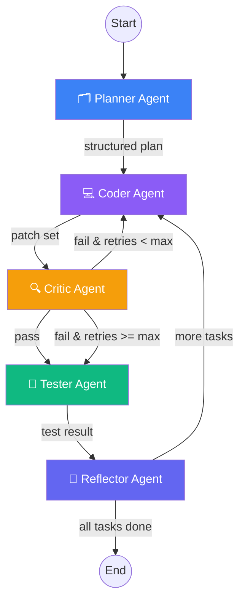

# Agent Loop (NEXUS Multi-Agent System)

> **Status:** ✅ Implemented in PR #2 (Agent Core)

## Overview

The NEXUS Agent Core is a LangGraph-based multi-agent system powered by Anthropic Claude Sonnet 4.5. It orchestrates five specialized agents in a pipeline with retry loops to generate high-quality code from natural language goals.

## Agent Graph (LangGraph)



## Agent Descriptions

| Agent | Role | Input | Output |
|-------|------|-------|--------|
| **Planner** | Breaks down user goal into ordered tasks | Goal + repo context | `Plan { tasks[] }` |
| **Coder** | Implements a single task | Task + acceptance criteria | `PatchSet { patches[] }` |
| **Critic** | Reviews code vs criteria | Task + patches | `CritiqueResult { pass, issues[], suggestions[] }` |
| **Tester** | Validates code (dry-run in PR #2) | Patches + test plan | `TestResult { pass, logs[] }` |
| **Reflector** | Writes retrospective to memory | Task + critique + outcome | `MemoryRecord { task, approach, outcome, lessons }` |

## Streaming Events

The agent pipeline emits Server-Sent Events as it progresses:

```
data: {"type":"plan","data":{"status":"running"},"timestamp":1700000001}
data: {"type":"plan","data":{"status":"complete","plan":{...}},"timestamp":1700000002}
data: {"type":"task_start","data":{"taskId":"task-1","title":"Create model"},"timestamp":1700000003}
data: {"type":"task_patch","data":{"taskId":"task-1","patches":{...}},"timestamp":1700000004}
data: {"type":"task_critique","data":{"taskId":"task-1","critique":{"pass":true,...}},"timestamp":1700000005}
data: {"type":"task_test","data":{"taskId":"task-1","testResult":{"pass":true,...}},"timestamp":1700000006}
data: {"type":"task_reflect","data":{"taskId":"task-1","memoryRecord":{...}},"timestamp":1700000007}
data: {"type":"task_done","data":{"taskId":"task-1","nextIndex":1},"timestamp":1700000008}
data: {"type":"done","data":{"totalTasks":2},"timestamp":1700000009}
```

## Capabilities

1. **Sees** — Screenshots its output and diffs against the target design using GPT-4o vision (stub in PR #2).
2. **Reasons** — LangGraph multi-agent orchestration with specialized agents for planning, coding, critiquing, testing, and reflecting.
3. **Talks** — Whisper STT + ElevenLabs TTS with push-to-talk and ambient mode (PR #6).
4. **Learns** — pgvector memory stores {task, approach, outcome, lessons} for future reference.
5. **Self-Tests** — Runs generated code in E2B sandboxes (PR #5); dry-run validation in PR #2.
6. **Reflects** — Post-build retrospective writes lessons learned to long-term memory.

## Memory Schema

Each memory entry contains:
- `task` — What was the user trying to build?
- `approach` — What strategy did the agent use?
- `outcome` — Did it succeed? What was the result?
- `lessons` — What should the agent do differently next time?
- `embedding` — Vector embedding for semantic retrieval (text-embedding-3-small).

## Extending with New Agents

To add a new agent to the pipeline:

1. Create the agent function in `/packages/agent-core/src/agents/your-agent.ts`
2. Add a prompt template in `/packages/agent-core/src/prompts/your-agent.ts`
3. Add the node in `/packages/agent-core/src/graph/index.ts`:
   ```ts
   graph.addNode("your-agent", async (state) => { ... });
   ```
4. Wire edges to/from the new node
5. Add the new event type to `StreamEventType` in `state/types.ts`
6. Export from `src/index.ts`

## Configuration

| Variable | Default | Description |
|----------|---------|-------------|
| `NEXUS_MODEL` | `claude-sonnet-4-5-20250929` | Claude model for agent LLM calls |
| `NEXUS_MAX_RETRIES` | `3` | Max Coder→Critic retry loops per task |
| `ANTHROPIC_API_KEY` | — | Anthropic API key (required) |
| `OPENAI_API_KEY` | — | OpenAI API key for embeddings (required for memory) |
